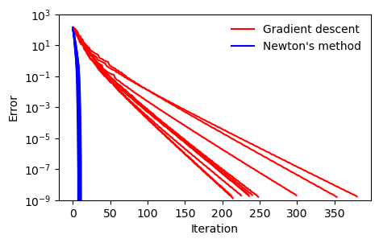
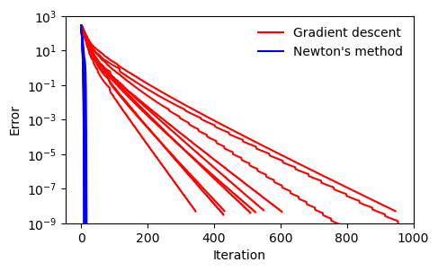

# IE602 Nonlinear Optimizationi Course Project
This project is to implement and compare 5 commonly used second-order methods: Newton’s 
method, barrier’s method, primal-dual interior-point methods, quasi-Newton
methods, and proximal Newton method using Python.

## Gradient Descent v.s. Newton's Method

